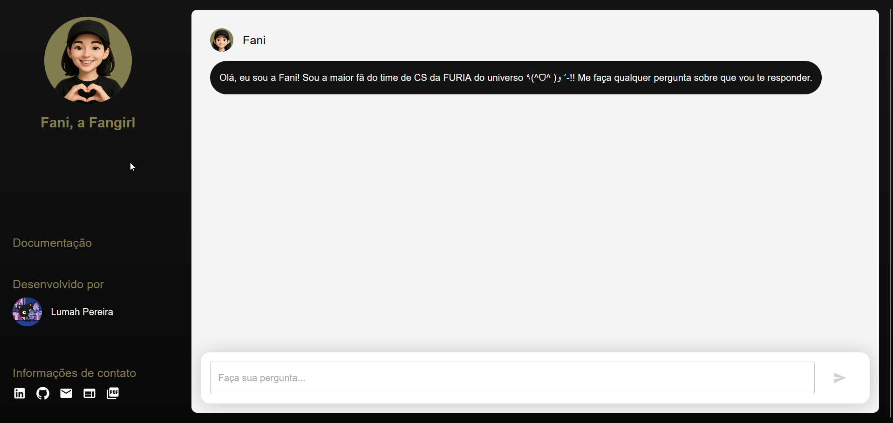

# Fani, a Fangirl
[](#) [](#) [](#) [](#) [](#) [](#) [](#) [](#) [](https://shields.io/)

**Fani, a Fangirl** is a ChatBot made especially for fans of **FURIA**'s **CS** teams who want to know all the facts about them. No more opening 300 screens to ask questions about your favorite team or looking for that information you can't find anywhere else, just ask **Fani** and the history of your messages will be saved.

## Screenshots


## Functionalities
- Receive messages regarding the FURIA CS team and respond accurately;
- Interpret the context of the message, resulting in the correct choice of the database to be used;
- Respect the rules and follow the context of answering only questions related to FURIA.

## How to run locally
A seguir, o passo a passo de reproduzir a aplicação localmente em sua máquina.

### Pre-requisites
- **Git**: install the latest version from the official website by clicking [here](https://git-scm.com/downloads);
- **Node.js**: install the latest version from the official website by clicking [here](https://nodejs.org/pt/download);
- **Python**: install the latest version from the official website by clicking [here](https://www.python.org/downloads/);

### Installing
First, clone the repository.
```bash
git clone https://github.com/lumahloi/furia-fangirl/
```

Navigate to the ```frontend``` directory.
```bash
cd frontend
```

Install your dependencies.
```bash
npm install
```

Navigate to the ```backend``` directory.
```bash
cd ../backend
```

Install your dependencies.
```bash
pip install -r requirements.txt
```

### Environment variables
In the ```.env.example``` file you can view the environment variables used by the project.
- Create the ```.env``` file in ```frontend``` and assign the value of the ```REACT_APP_API_URL``` variable;
- Create the ```.env``` file in ```backend``` and assign the value of the ```OPENAI_KEY``` variable.

### Running locally
Open a terminal and run the ```frontend``` server in the ```frontend``` directory.
```bash
npm run start
```

Open another terminal and run the ```backend``` server in the ```backend``` directory.
```bash
python app.py
```


## APIs
Below is a list of all available endpoints.

### Send message
#### URL
```bash
POST /api/query/
```

#### Request header
```bash
Content-Type: application/json
```

#### Request body
```bash
{
  "input": "qual o squad atual da FURIA?"
}
```

#### Response example
```bash
{
  "response": "O squad atual da FURIA no CS:GO \u00e9 composto por Yuri \"yuurih\" Boian, Kaike 
  \"KSCERATO\" Cerato, Gabriel \"FalleN\" Toledo, Danil \"molodoy\" Golubenko e Mareks \"YEKINDAR\"
  Ga\u013cinskis (este \u00faltimo como stand-in). Sidnei \"sidde\" Macedo atua como t\u00e9cnico da 
  equipe."
}
```


## Possible improvements
- [ ] Add context about Fani and the possibility of action;
- [ ] List of topics for the user that Fani can answer;
- [ ] Question cache system;
- [ ] Storage of chats in a database;
- [ ] Chat history;
- [ ] Creation of accounts.

## Author


***Lumah Pereira***


[](https://www.linkedin.com/in/lumah-pereira) [](https://www.github.com/lumahloi) [](https://www.lumah-pereira.vercel.app)