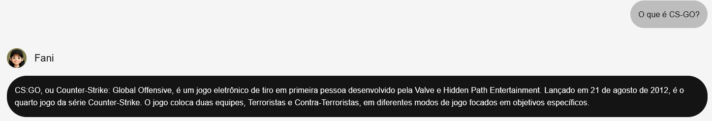

# Funcionalidades principais
- Receber mensagens a respeito do time de CS da FURIA e responder com precisão;
- Interpretação do contexto da mensagem, resultando na escolha correta do banco de dados a ser utilizado;
- Respeitar as regras e seguir o contexto de responder somente perguntas relacionadas a FURIA.

## Exemplos de resposta
A **Fani** reconhece corretamente o seu objetivo e escopo de perguntas que podem ser respondidas.

Ela responde informações factuais com precisão.

Apesar de não haver uma definição clara de CS-GO no banco de dados, **Fani** entende que a pergunta está dentro do escopo e responde adequadamente a pergunta do usuário.

